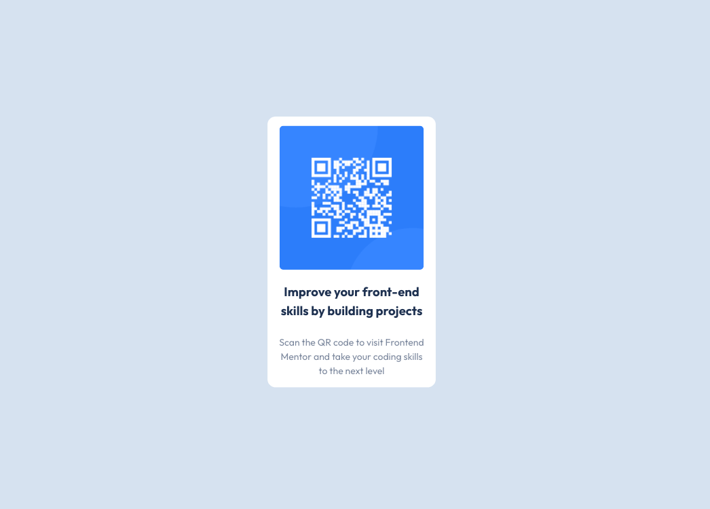

# Frontend Mentor - QR code component solution

This is a solution to the [QR code component challenge on Frontend Mentor](https://www.frontendmentor.io/challenges/qr-code-component-iux_sIO_H). Frontend Mentor challenges help you improve your coding skills by building realistic projects. 

## Table of contents

- [Overview](#overview)
  - [Screenshot](#screenshot)
  - [Links](#links)
- [My process](#my-process)
  - [Built with](#built-with)
  - [What I learned](#what-i-learned)
  - [Continued development](#continued-development)
  - [Useful resources](#useful-resources)

## Overview

### Screenshot

### Links

- Live Site URL: [Github Pages](https://jdegand.github.io/qr-code-component)

## My process

### Built with

- SolidJS
- Skypack
- CSS

### What I learned

- Solid is React-like and I wanted to check it out.  
- className doesn't work with skypack implementation?
- CSS design problems => shrink font-size.

### Continued development

- Need more padding on bottom card to make exact.  But then font-sizes have to shrink.

### Useful resources

- [SolidJS](https://www.solidjs.com/)
- [Skypack](https://www.skypack.dev/)
- [Solid Tutorial](https://www.solidjs.com/tutorial/bindings_style) - className & class are recognized ?